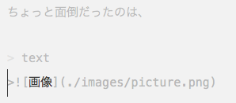
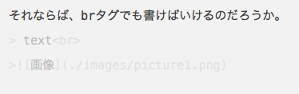

# MarkDownを始めよう

知人からWordの愚痴を書いたら「[MarkDown](http://ja.wikipedia.org/wiki/Markdown)」を勧められた。
この文章も練習がてらMarkDownで記述している。

## Editor
MarkDownに対応したエディタが沢山出ている。
[エンジニアならトコトンこだわりたい！Markdownエディタ20選【Mac, iPhone他】](http://www.find-job.net/startup/20-markdown-editors)
PC以外にもiPhone,iPadから書きたいという欲求まであるようだ。

勧められた「[Byword](http://bywordapp.com)」を使うことにしてみた。
文章を書くことに特化されているので、余計なものが全くなくて却って戸惑うことになった。

## 画像の表示の仕方が分からない。
画像の表示の仕方が分からなかった。
なんてことはない。
アカウントを作ったときに一番最初からある[HelloWord](https://github.com/gansaibow/Hello-World)に書かれていた。

ちょっと面倒だったのは、このように書くと画像の改行が聞かないらしく隣に来てしまうらしい。

> text
>

それならば、brタグでも書けばいけるのだろうか。
> text 
>

