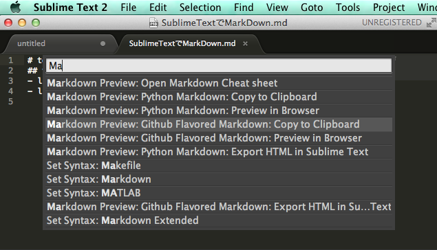
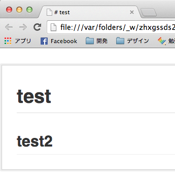

# Sublime TextでMarkDown

Install Packageから、*Markdown Extended*と*Markdown Preview*を検索してインストールする。

Command + Shift + Pで*Markdown Preview: Github Flavored Markdown:Preview in Browser*を選択する。  
  

BrowserでMarkdownを確認することが出来る。  
  

