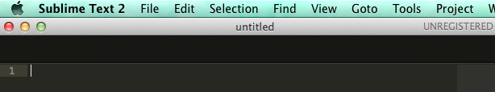
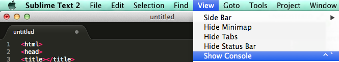
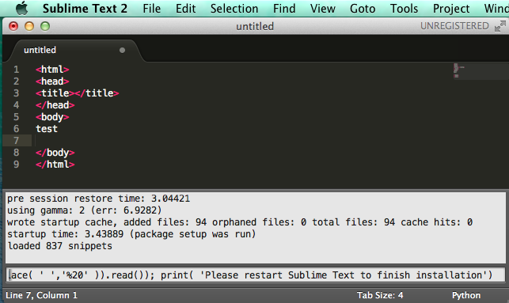
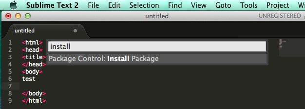
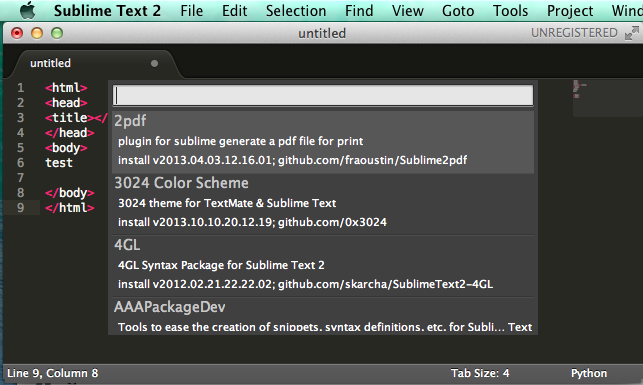

HTML5関連の講座を聞いていると、以下の３つの名前をよく聞く  
- Sublime Text
- Grunt
- Bower

SublimeTextというテキストエディタはプラグインがわんさかあって、  
一人の開発であればさくさく作成できてしまうそうだ。

## 入手してみる
SublimeTextは評価版があるので、無料で操作することができる。  
[http://www.sublimetext.com/2/](http://www.sublimetext.com/2)  
Mac,Windows,Linuxといろんなプラットフォームに対応している。
 
 

## 始めにすること
SublimeTextを入れてみた。

 
 

## プラグインを入れたい！
*Package Control*という便利なパッケージがあるらしい  

>View -> Show Console  
>  

以下のコードをコンソールにコピーペースとする。  
> import urllib2,os; pf='Package Control.sublime-package'; ipp = sublime.installed_packages_path(); os.makedirs( ipp ) if not os.path.exists(ipp) else None; urllib2.install_opener( urllib2.build_opener( urllib2.ProxyHandler( ))); open( os.path.join( ipp, pf), 'wb' ).write( urllib2.urlopen( 'http://sublime.wbond.net/' +pf.replace( ' ','%20' )).read()); print( 'Please restart Sublime Text to finish installation')  
>   

Enterを押して実行する。  
コマンドの処理が終わったら再起動する。  
> コマンドパレットを開く  
> Cmd + Shift + P  
> installと入力し「Package Control: Install Packages」を選択して、Enterを押下  
>   
> 一覧に出てくるパッケージを選択すればプラグインを追加することが出来る。  
>   

