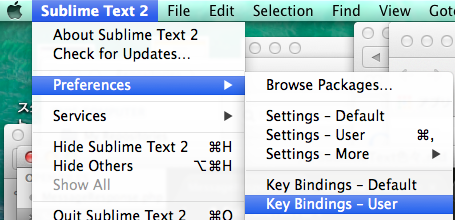
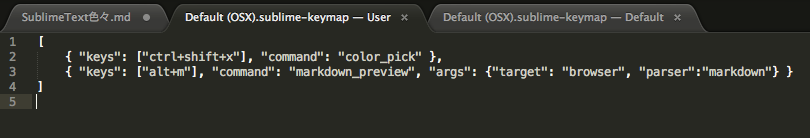

# SublimeText色々

## ショートカットキーを追加する

>Sublime Text 2 -> Preference -> Key Binding - Usr  
>

>{ "keys": ["キー"], "command": "コマンドの実行コマンド" }  
>  

> ショートカットを適用したいPluginがGithubで公開されている  
> README.mdにショートカットキーに必要なコマンドが書かれているので"コマンドの実行コマンド"のところにコピペする。    
>  
