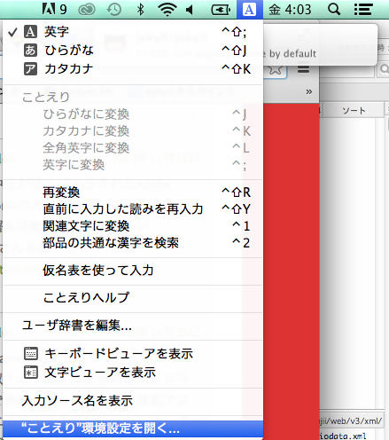
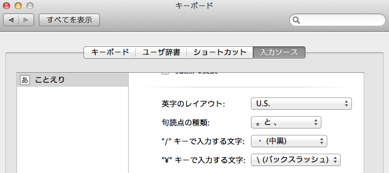

# 改行コードの修正
今年になってからMacbookでコーディングすることになって、キーボードの入力が地味に分からないことが多々あってストレスだった。  
特にC#やphpの改行コードを入力したい場合が大変だった。  
Windowsでは¥nと入力すればよかったのが、Macbookでは\nと入力しなくてはならない。
\はどうやって打ったらいいのだろう？  
結局打ち方を探すより、ネットからコピペすることで対処していた。  
１キーでも無駄を無くすためにいい機会なので直す。  

=======

## Optionキー + ¥キー
実は、Optionキー + ¥キーで\を入力することが出来る。
でも、¥キーを打ったら\が入力されるようにしたい。  

=======

## ことえりの環境設定を変える
[ことえり](http://ja.wikipedia.org/wiki/%E3%81%93%E3%81%A8%E3%81%88%E3%82%8A)とは
> ことえりとは、アップルのオペレーティングシステム (OS) であるMac OS日本語版[1]およびOS X、OS X Serverに組み込まれている日本語入力プログラムである。

ことえりの環境設定を変更すれば、いいらしいことが分かった。  
しかし、Mavericksから[ことえりの環境設定方法が変わった](http://www.macotakara.jp/blog/mac_os_x/entry-21451.html)ようだ。
右上の[A]または[あ]を押してから、["ことえり"の環境設定を開く...]を選択する。
  

[入力ソース]タブを選択し、["¥"キーで入力する文字]を「¥(円記号)」から「\(バックスラッシュ)」に変更する。
  

これで、¥キーを打てば\を入力することが出来るようになった。